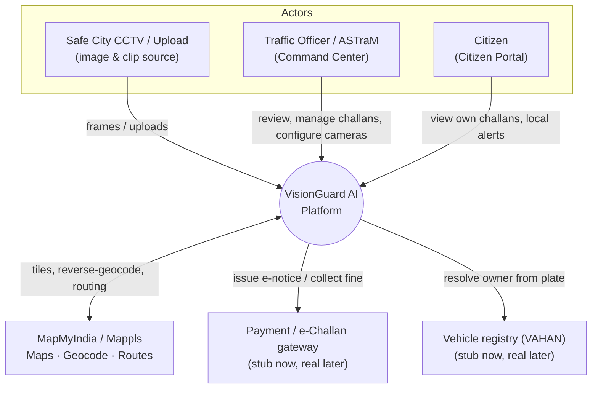
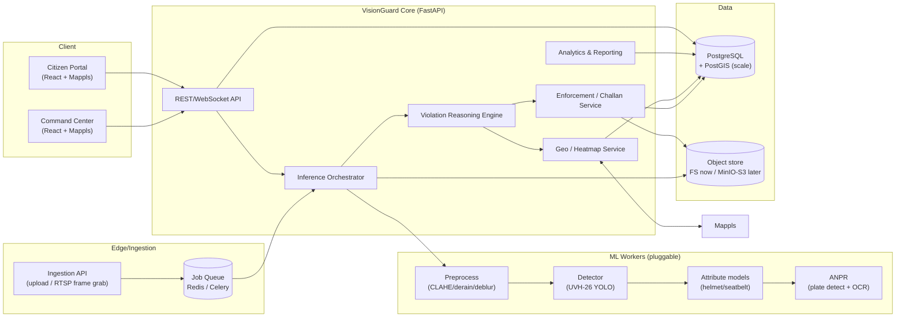
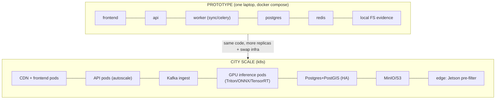

# 03 — High-Level Design (HLD)

> This is the architecture from 10,000 ft. Implementation details (schemas, signatures) live in
> [04_LLD.md](04_LLD.md). The scaled version lives in [07_SCALABILITY_ROADMAP.md](07_SCALABILITY_ROADMAP.md).

## 1. Design goals & principles

| Goal | How the architecture honours it |
|---|---|
| **End-to-end working now** | Single Docker Compose brings up the full loop on a laptop |
| **Scales to whole city** | Every component is stateless or queue-fed; nothing assumes "one machine" |
| **Free at every stage** | OSS only (FastAPI, Postgres, Redis, React, YOLO, PaddleOCR, Mappls free tier) |
| **Domain-correct** | Models pre-trained on Bengaluru Safe City data (UVH-26/BMD-45) |
| **Reuse proven patterns** | Enforcement loop mirrors MLFF/FASTag (ANPR → evidence → e-notice) |
| **Fair enforcement** | Confidence gating + human-review queue + occupied-vehicle heuristic |
| **Pluggable models** | Each detector is a service behind an interface; swap models without touching API |

## 2. C4 — Level 1: System Context

## 3. C4 — Level 2: Container / Layer view

## 4. Logical layers (responsibilities)

1. **Ingestion Layer** — accepts a single image upload, a batch, or pulls frames from an RTSP camera.
   Normalises into a `Job` (image ref + camera_id + timestamp) and enqueues it. *Scale knob: more
   ingestion pods + Kafka instead of one API.*

2. **Preprocessing Layer** — quality enhancement so downstream models see clean inputs:
   - Low-light: CLAHE / Zero-DCE-style enhancement
   - De-noise / de-blur (motion blur from moving vehicles)
   - De-rain / shadow handling, white-balance, resize/letterbox to model input
   - Quality gate: if image is too degraded → flag "unusable", skip fining.

3. **Perception Layer (CV core)** — three pluggable model stages:
   - **Detector**: vehicles (14 classes, UVH-26), persons, plates.
   - **Attribute models**: helmet/no-helmet on rider crops; seatbelt on windshield crops (beta).
   - **ANPR**: plate detection → crop → OCR (PaddleOCR/EasyOCR) → normalise to Indian plate regex.

4. **Violation Reasoning Engine** — turns raw detections + per-camera ROI config into **violations with
   confidence**. Pure, testable functions. Handles:
   - helmet, triple-riding, seatbelt (attribute-based)
   - stop-line, red-light, wrong-side, illegal-parking (geometry + context-based)
   - **safety alerts**: accident, traffic-jam/overcrowding (zero-fine)
   - false-positive suppression (occupied-vehicle heuristic, confidence gating).

5. **Enforcement / Challan Layer** — finable violation → **challan** (fine from Indian schedule) →
   **e-notice** (mirrors MLFF 72h notice) → lifecycle (issued → notified → paid/contested/expired).
   Links to evidence + plate + location.

6. **Geo / Heatmap Layer** — resolves `camera_id` → lat/long → Mappls reverse-geocoded address;
   aggregates incidents into a **severity-weighted heatmap**; auto-updates hotspots.

7. **Storage Layer** — **metadata** in Postgres (challans, detections, cameras, users, audit);
   **binary evidence** (original + annotated images, crops) in object store.

8. **Analytics & Reporting Layer** — KPIs, trends, searchable records, exportable reports.

9. **Presentation Layer** — **Command Center** (full control) + **Citizen Portal** (read-only, scoped).

10. **Cross-cutting** — AuthN/AuthZ (RBAC), audit logging, config, observability, model registry.

## 5. Component → task traceability (proof we cover the brief)

| Problem task | Owning component(s) |
|---|---|
| 1. Image preprocessing | Preprocessing Layer |
| 2. Vehicle & road-user detection | Detector (UVH-26) |
| 3. Violation detection | Violation Reasoning Engine + Attribute/ANPR |
| 4. Violation classification + confidence | Violation Reasoning Engine |
| 5. License plate recognition | ANPR (detect + OCR) |
| 6. Evidence generation | Orchestrator (annotation) + Storage |
| 7. Analytics & reporting | Analytics Layer + Command Center |
| 8. Performance evaluation | ML eval harness ([11](11_PERFORMANCE_EVALUATION.md)) |
| + Enforcement (our extension) | Challan Service |
| + Spatial intelligence (our extension) | Geo/Heatmap + Mappls |
| + Citizen transparency (our extension) | Citizen Portal |

## 6. Deployment view — prototype vs scale

**The promise:** moving from prototype to scale is a **configuration + infra swap**, not a rewrite,
because (a) workers are stateless and queue-fed, (b) storage is abstracted behind an interface
(FS ↔ S3), (c) DB is Postgres in both (add PostGIS + replicas), (d) models are versioned artifacts.

## 7. Key quality attributes

- **Scalability:** horizontal workers; queue back-pressure; stateless API.
- **Availability:** prototype single-node; scale = replicas + managed Postgres.
- **Performance:** CPU-OK prototype (≤2s/img); GPU/edge for real-time.
- **Security/Privacy:** RBAC, audit log, person/face blur on citizen evidence, encrypted secrets.
- **Maintainability:** clear module boundaries; model registry; typed API contracts (OpenAPI).
- **Observability:** structured logs, metrics (Prometheus-ready), request tracing.
