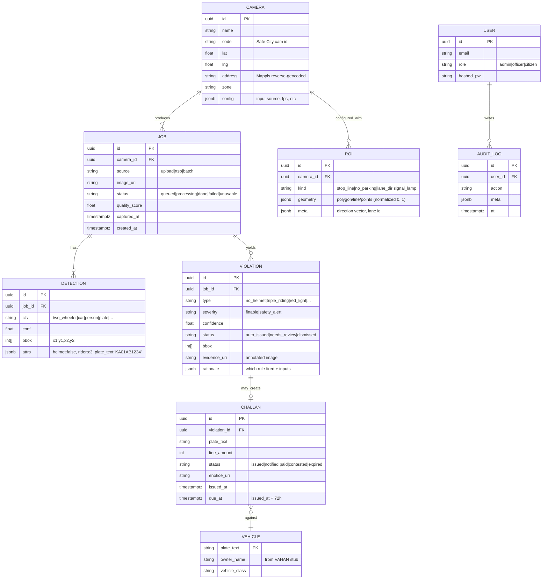

# 04 — Low-Level Design (LLD)

> Concrete contracts: data model, REST API, model I/O, the violation rule definitions, and module
> layout. Names here match the code in `backend/` and `ml/`.

## 1. Module / package layout

```
backend/app/
  main.py                 # FastAPI app factory, routers, middleware
  core/
    config.py             # settings (env), constants (fine schedule, thresholds)
    security.py           # auth, RBAC, JWT
    logging.py            # structured logging
    storage.py            # StorageBackend interface (LocalFS now, S3 later)
  db/
    base.py               # SQLAlchemy engine/session
    models.py             # ORM tables
    seed.py               # demo cameras, users, sample data
  schemas/                # Pydantic request/response models
    detection.py  violation.py  challan.py  camera.py  analytics.py
  services/
    ingestion.py          # accept upload / frame, create Job
    orchestrator.py       # runs preprocess→detect→attr→anpr, builds evidence
    violation_engine.py   # detections + ROI -> violations (PURE functions)
    enforcement.py        # violation -> challan -> e-notice lifecycle
    geo.py                # camera->latlng, Mappls reverse-geocode, heatmap agg
    analytics.py          # KPIs, trends, search
  api/
    routes_ingest.py routes_violations.py routes_challans.py
    routes_cameras.py routes_analytics.py routes_citizen.py

ml/
  pipeline/
    preprocess.py         # enhance(image) -> image, quality_score
    detector.py           # Detector.predict(image) -> [Detection]
    helmet.py             # HelmetModel.predict(rider_crop) -> label, conf
    anpr.py               # detect_plate + ocr -> PlateResult
    annotate.py           # draw boxes/labels -> annotated image bytes
  models/                 # model wrapper classes + registry
  weights/                # downloaded weights (gitignored)
  configs/                # class maps, thresholds, model paths
  eval/                   # metrics harness (see doc 11)
```

## 2. Data model (PostgreSQL via SQLAlchemy)



> **Prototype simplification:** SQLite is acceptable for the laptop demo (SQLAlchemy URL swap). Use
> Postgres in Docker Compose so the demo already matches the scale target. PostGIS only needed at scale.

## 3. Canonical class & violation enums

```python
# ml/configs/classes.py
VEHICLE_CLASSES = [
    "bicycle","two_wheeler","auto_rickshaw","car","bus","van",
    "commercial_vehicle","truck","other",
]
ROAD_USER_CLASSES = ["person", "plate"]

VIOLATION_TYPES = {
    # finable -> fine in INR (mirrors Indian schedule; tune as needed)
    "no_helmet":          {"severity": "finable", "fine": 1000},
    "seatbelt":           {"severity": "finable", "fine": 1000},
    "triple_riding":      {"severity": "finable", "fine": 1000},
    "wrong_side":         {"severity": "finable", "fine": 5000},
    "stop_line":          {"severity": "finable", "fine": 1000},
    "red_light":          {"severity": "finable", "fine": 2000},
    "illegal_parking":    {"severity": "finable", "fine": 500},
    # safety alerts -> zero fine
    "accident":           {"severity": "safety_alert", "fine": 0},
    "traffic_jam":        {"severity": "safety_alert", "fine": 0},
}

# per-violation confidence threshold; below -> needs_review (no auto challan)
CONF_THRESHOLDS = {
    "no_helmet": 0.55, "triple_riding": 0.60, "illegal_parking": 0.65,
    "stop_line": 0.60, "red_light": 0.70, "wrong_side": 0.70, "seatbelt": 0.65,
}
```

## 4. Model I/O contracts (the pluggable interfaces)

```python
# ml/pipeline/detector.py
@dataclass
class Detection:
    cls: str            # canonical class
    conf: float
    bbox: tuple[int,int,int,int]
    attrs: dict          # filled later (helmet, riders, plate_text)

class Detector(Protocol):
    def predict(self, image: np.ndarray) -> list[Detection]: ...

# ml/pipeline/preprocess.py
def enhance(image: np.ndarray) -> tuple[np.ndarray, float]:
    """returns (clean_image, quality_score in 0..1)."""

# ml/pipeline/helmet.py
class HelmetModel(Protocol):
    def predict(self, rider_crop: np.ndarray) -> tuple[str, float]:  # ("helmet"|"no_helmet", conf)
        ...

# ml/pipeline/anpr.py
@dataclass
class PlateResult:
    text: str           # normalized, e.g. "KA01AB1234"
    conf: float
    bbox: tuple[int,int,int,int]
def read_plate(image: np.ndarray, plate_bbox=None) -> PlateResult | None: ...
```

> **Pluggability:** swapping UVH-26 YOLOv11 → RT-DETRv2 → a fine-tuned model is just a new class
> implementing `Detector`. The orchestrator, engine, and API never change.

## 5. The Violation Reasoning Engine (the brain)

Pure functions: `(detections, roi_config, mode) -> list[Violation]`. `mode ∈ {image, clip}`.

### 5.1 Attribute-based (single image is enough)

| Violation | Rule (pseudologic) |
|---|---|
| **no_helmet** | For each `two_wheeler`, find overlapping `person` rider crops; run `HelmetModel`; if any rider `no_helmet` → violation. conf = helmet_conf × det_conf |
| **triple_riding** | For each `two_wheeler`, count `person` boxes whose centroid ∈ bike box (with vertical tolerance). count ≥ 3 → violation |
| **seatbelt** (beta) | For each `car` front-windshield ROI, run seatbelt classifier on driver region → no_belt → violation |

### 5.2 Geometry/context-based (needs per-camera ROI; clip helps)

| Violation | Inputs | Rule |
|---|---|---|
| **stop_line** | `stop_line` ROI (line) + vehicle bbox | vehicle's front edge crosses the line into the junction box |
| **red_light** | `signal_lamp` ROI + `stop_line` + (signal state) | signal state == RED **and** stop_line crossed → violation. Signal state from HSV/classifier on lamp ROI or external signal feed |
| **wrong_side** | `lane_dir` ROI (allowed direction vector) + heading | vehicle heading · allowed_dir < 0 → wrong side. heading from 2-frame motion (clip) or orientation heuristic (image) |
| **illegal_parking** | `no_parking` ROI (polygon) + dwell + persons | vehicle centroid ∈ no_parking AND (clip: dwell > T) AND **no person overlapping/near** (occupied-vehicle heuristic) → violation |

### 5.3 Safety alerts (zero fine)

| Alert | Rule |
|---|---|
| **traffic_jam** | vehicle_count in frame ≥ density_threshold (per camera, calibratable) → jam alert; severity scales with count |
| **accident** | (a) optional accident classifier on full frame, or (b) heuristic: ≥2 vehicles with high bbox overlap + abnormal orientation + person on road → flag for review |

### 5.4 False-positive controls (applied last)

1. **Occupied-vehicle heuristic** → suppress illegal_parking if person overlaps/near vehicle.
2. **Confidence gating** → if `confidence < CONF_THRESHOLDS[type]` → `status = needs_review`.
3. **Quality gate** → if `job.quality_score` below floor → no finable violations (safety alerts allowed).
4. **De-duplication** → same plate+type+camera within N minutes counts once.

### 5.5 Output object

```python
Violation(
  type="no_helmet", severity="finable", confidence=0.78,
  bbox=(x1,y1,x2,y2), status="auto_issued",
  rationale={"rule":"no_helmet","rider_conf":0.82,"det_conf":0.95},
  evidence_uri="evidence/<job>/annotated.jpg",
)
```

## 6. REST API (OpenAPI surface)

Base: `/api/v1`. Auth: Bearer JWT. Roles: `admin`, `officer`, `citizen`.

### Ingestion & processing
| Method | Path | Role | Body / Query | Returns |
|---|---|---|---|---|
| POST | `/ingest/image` | officer | multipart: `file`, `camera_id`, `captured_at?` | `Job` (id, status) |
| POST | `/ingest/batch` | officer | multipart: zip / many files | `[Job]` |
| GET | `/jobs/{id}` | officer | — | `Job` + detections + violations |
| POST | `/jobs/{id}/reprocess` | officer | — | `Job` |

### Violations & review
| GET | `/violations` | officer | filters: type, status, camera, date | paginated list |
| POST | `/violations/{id}/confirm` | officer | — | issues challan |
| POST | `/violations/{id}/dismiss` | officer | reason | dismissed |

### Challans
| GET | `/challans` | officer | filters: plate, status, date | paginated |
| GET | `/challans/{id}` | officer | — | challan + evidence + e-notice |
| POST | `/challans/{id}/pay` | officer/system | — | status→paid (stub gateway) |

### Cameras & ROI config
| GET/POST | `/cameras` | admin | camera CRUD | camera(s) |
| GET/POST/DELETE | `/cameras/{id}/roi` | admin | ROI geometry | roi(s) |

### Geo & analytics
| GET | `/geo/heatmap` | officer | bbox, type?, since? | GeoJSON weighted points |
| GET | `/analytics/kpis` | officer | range | counts (challans, cameras, accidents, jams) |
| GET | `/analytics/trends` | officer | groupby=day/type/zone | series |

### Citizen (read-only, scoped)
| GET | `/citizen/challans?plate=` | citizen | own plate(s) | their challans only |
| GET | `/citizen/alerts?lat=&lng=&radius=` | citizen | local area | nearby safety alerts |

### Realtime
| WS | `/ws/live` | officer | — | push: new violation/alert events for live map |

## 7. Mappls integration points (LLD)

| Use | API | When |
|---|---|---|
| Base map tiles + markers | Mappls Web Map SDK (JS) | frontend render |
| `camera lat/lng → address` | Reverse Geocode REST | on camera create / challan issue |
| Citizen "near me" + patrol routes | Routes / Nearby REST | citizen alerts, patrol planning |
| Auth | Mappls license key (free dev tier) in `.env` (`MAPPLS_KEY`) | all of the above |

> Keep the Mappls logo + attribution visible (license requirement). Cache reverse-geocode results in the
> `camera.address` column to stay within free-tier hit limits.

## 8. Config & secrets (`.env`)

```
DATABASE_URL=postgresql+psycopg://vg:vg@db:5432/visionguard   # or sqlite:///./visionguard.db
REDIS_URL=redis://redis:6379/0
STORAGE_BACKEND=local            # local | s3
STORAGE_DIR=./data/evidence
MAPPLS_KEY=__your_free_key__
JWT_SECRET=__random__
MODEL_DETECTOR=ml/weights/uvh26/yolov11s.pt
MODEL_HELMET=ml/weights/helmet/best.pt
CONF_FLOOR=0.25
```

## 9. Error handling & edge cases

- **Unusable image** (quality below floor) → `job.status=unusable`, no challan, surfaced in UI.
- **No plate readable** → challan created as `plate_text="UNREADABLE"`, routed to review (mirrors MLFF
  "unidentified vehicle" flag).
- **Model missing** → orchestrator falls back to COCO YOLO for vehicles/persons so the demo never hard-fails.
- **Mappls key absent** → frontend falls back to a static map placeholder; backend skips reverse-geocode.
