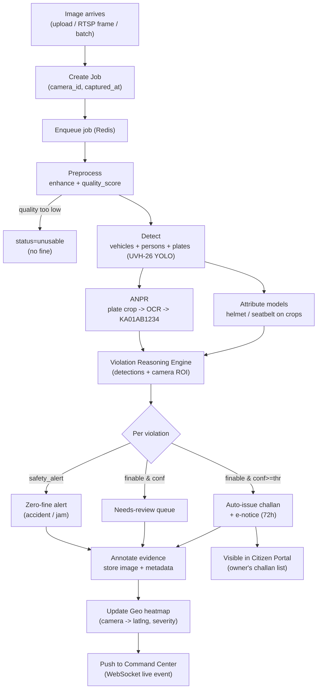
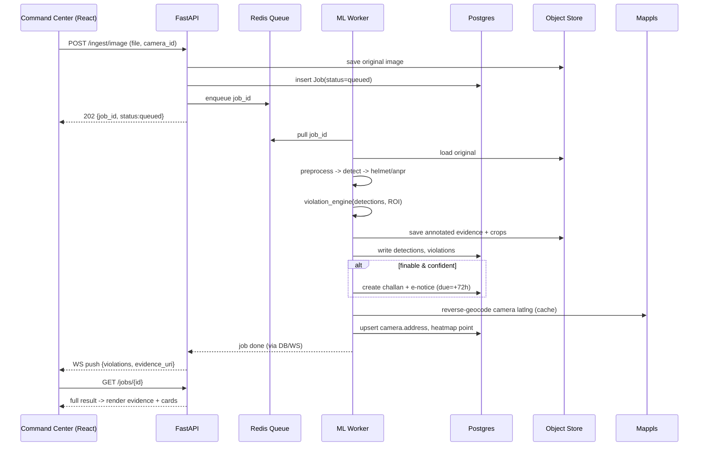
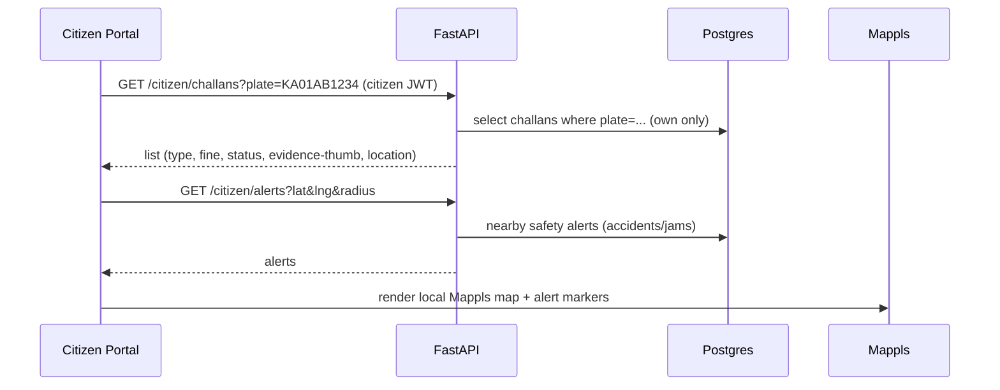
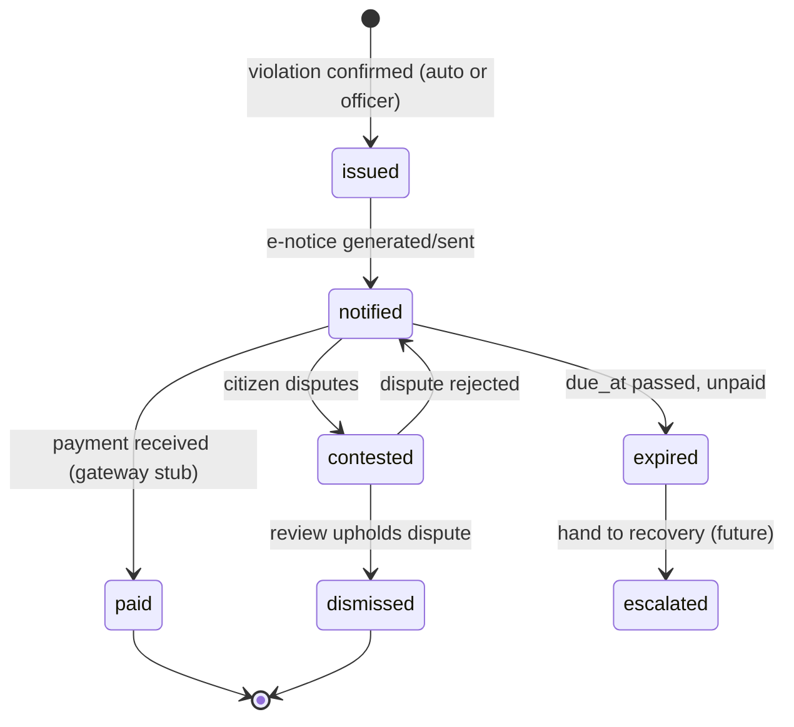
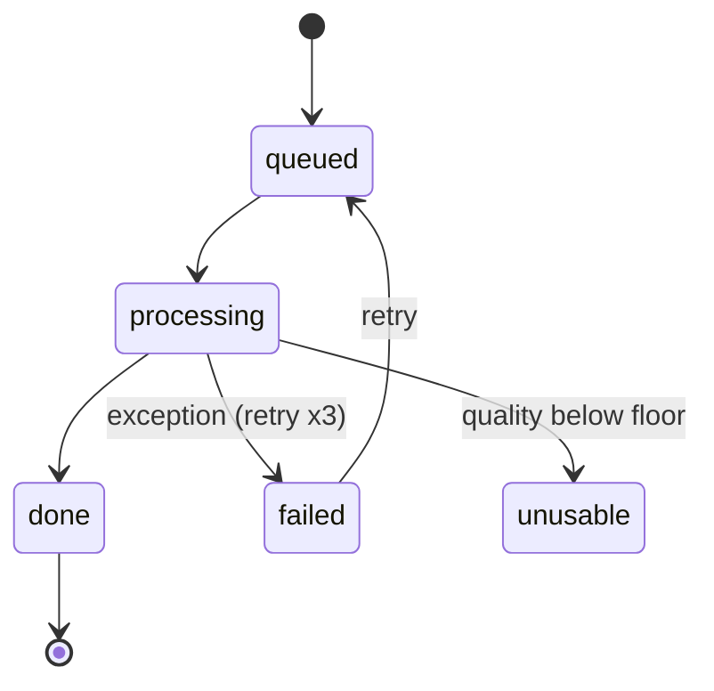
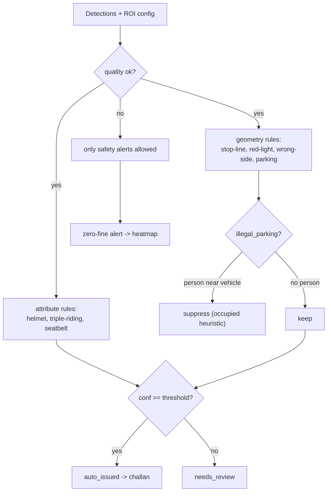
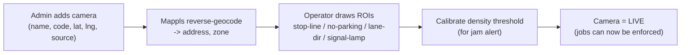

# 05 — End-to-End Workflow

> How a pixel becomes a challan. Read alongside [04_LLD.md](04_LLD.md).

## 1. The master pipeline (one image → outcomes)

## 2. Sequence — single image upload (Command Center)

## 3. Sequence — citizen checking their challans

## 4. Challan lifecycle (state machine)

## 5. Job status lifecycle

## 6. Violation decision flow (the engine, expanded)

## 7. Camera onboarding workflow (one-time per camera)

> Until ROIs are configured, that camera only emits **attribute violations** (helmet, triple-riding) +
> **safety alerts**; geometry violations stay in review. This keeps the system honest per-camera.

## 8. Daily operations loop (Command Center)

1. Live map shows incoming violations/alerts (WebSocket).
2. KPI cards refresh (challans today, active cameras, accident alerts, jam zones).
3. Officer works the **needs-review** queue: confirm → challan, or dismiss → reason logged (audit).
4. Heatmap reveals hotspots → patrol/infrastructure decisions.
5. Reports exported for the day/zone.

## 9. Batch / historical analysis workflow

- Drop a folder/zip of historical Safe City frames → `/ingest/batch` → workers fan out → analytics
  populate trends → identify chronic hotspots and peak-violation hours. (This is the offline mirror of
  the live loop and is how we'd "replay" ASTraM's archived footage.)
