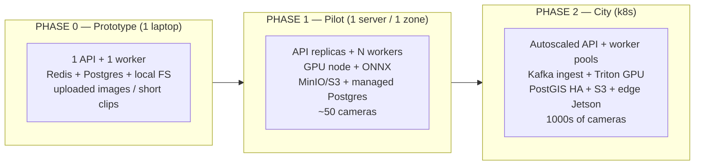
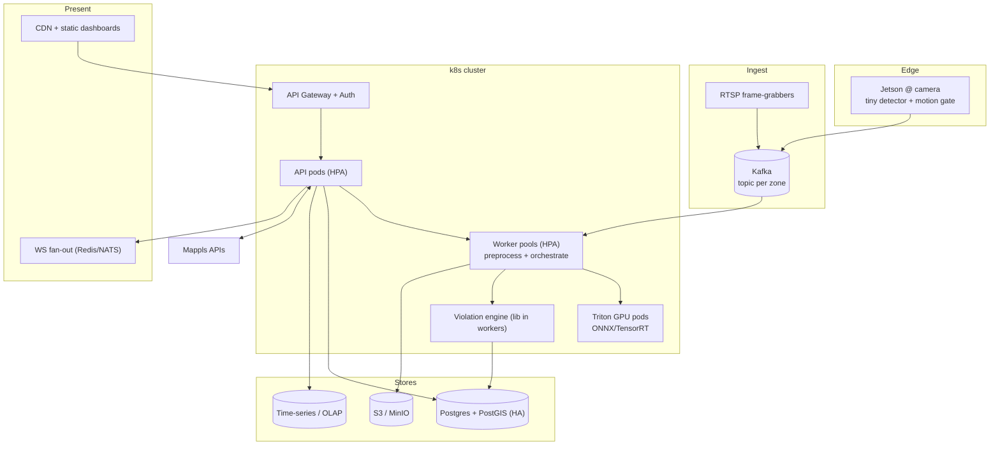

# 07 — Scalability Roadmap (prototype → whole-city)

> The extended brief demands a working prototype that is **architected to scale to the entire city and
> handle future load**. This doc shows the exact path. Core idea: **the prototype already uses the
> primitives that scale; going city-wide is replicas + infra swaps, not a rewrite.**

## 1. The scaling thesis in one picture

## 2. What stays the same (the reason scaling is cheap)

| Component | Prototype | Scaled | Code change? |
|---|---|---|---|
| API | 1 FastAPI | autoscaled FastAPI pods | **none** (stateless) |
| Queue | Redis/Celery | Redis Cluster or Kafka | adapter swap |
| Workers | 1 process | worker pools (CPU+GPU) | **none** (add replicas) |
| Storage | local FS | MinIO/S3 | **none** (StorageBackend interface) |
| DB | Postgres | Postgres+PostGIS HA | add extension/replicas |
| Models | YOLO `.pt` on CPU | ONNX/TensorRT on Triton | export step, same interface |
| Frontend | Vite dev server | static build on CDN | build step |

> Because of the `StorageBackend` interface, the queue abstraction, stateless workers, and the `Detector`
> protocol, **none of the business logic changes** when scaling.

## 3. Scaling each layer

### 3.1 Ingestion — from uploads to 1000s of live streams
- **Now:** HTTP upload / batch zip.
- **Pilot:** RTSP frame-grabber service per camera group; sample at N fps (don't process every frame).
- **City:** **Kafka** topic per zone; producers = edge devices / frame-grabbers; consumers = worker pools.
  Back-pressure handled by Kafka; drop/downsample under load gracefully.
- **Edge pre-filter (key cost saver):** run a tiny detector on a **Jetson** at the camera; only upload
  frames that *contain* candidate violations (motion + vehicle present). Cuts central compute 10–100×.

### 3.2 Inference — from CPU to GPU fleet
- **Now:** Ultralytics YOLO on CPU (small model).
- **Pilot:** export to **ONNX**; run on a single GPU; batch requests.
- **City:** **NVIDIA Triton Inference Server** hosting ONNX/**TensorRT** engines; dynamic batching;
  model ensembles; horizontal GPU pods; model versioning + canary rollout via the model registry.
- **Cost control:** edge pre-filter + frame sampling + cascade (cheap model first, expensive only on hits).

### 3.3 Data — from SQLite/FS to HA Postgres + S3
- **Metadata:** Postgres → Postgres+**PostGIS** (native spatial heatmap queries) → read replicas +
  partitioning by date/zone; time-series (challan counts) optionally to Timescale/ClickHouse.
- **Evidence blobs:** local FS → **MinIO/S3** with lifecycle policies (hot 90d → cold archive); CDN for
  thumbnails.

### 3.4 Geo/heatmap — from per-point to aggregated tiles
- **Now:** aggregate points in app, render markers.
- **City:** PostGIS spatial aggregation + pre-computed **heatmap tiles**; Mappls layers; cache hot zones.

### 3.5 API/frontend
- API: stateless → HPA (autoscale on CPU/queue depth). Rate-limit + API gateway.
- Frontend: static build on CDN; WebSocket via a pub/sub (Redis/NATS) fan-out for many officers.

### 3.6 Reliability & ops
- Health checks, retries with backoff, dead-letter queue for failed jobs.
- Observability: **Prometheus + Grafana** (metrics), structured logs → Loki/ELK, tracing (OpenTelemetry).
- Blue/green or canary deploys; model canary (route 5% traffic to new model, compare metrics).

## 4. Scaled HLD (target architecture)

## 5. Scaled LLD deltas (what concretely changes in code/config)

| Area | Prototype impl | Scaled impl | File touched |
|---|---|---|---|
| Storage | `LocalFSStorage` | `S3Storage` (boto3/minio) | `core/storage.py` (new class, same interface) |
| Queue | Celery+Redis | Celery+Redis Cluster / Kafka consumer | `services/ingestion.py`, worker entry |
| Detector | `UltralyticsDetector` (.pt) | `TritonDetector` (gRPC) | `ml/pipeline/detector.py` (new class) |
| DB | Postgres | + PostGIS, partitions, replicas | migration only |
| Heatmap | app-side agg | PostGIS `ST_*` + tile cache | `services/geo.py` |
| Config | `.env` | k8s ConfigMap/Secret + per-zone overrides | helm values |

## 6. Capacity model (back-of-envelope for the deck)

Assume Bengaluru ~ 3,000 cameras, sample 1 frame / 2s per camera = 1,500 fps aggregate.
- With **edge pre-filter** passing ~5% → ~75 fps reach the center.
- One GPU (TensorRT, YOLOv11s, batched) ≈ 300–800 fps detection.
- → **~1–3 GPU nodes** handle the *whole city's* central detection load; workers + API scale on CPU.

> This is the headline scalability claim: *edge filtering + batched GPU inference makes whole-city
> coverage a single-digit-GPU problem, not a datacenter problem.*

## 7. Phased rollout plan (what to actually do, in order)

1. **Phase 0 (this repo):** laptop prototype, full loop, uploads + clips, one zone of demo cameras.
2. **Phase 1 (pilot):** one junction cluster (10–50 cameras), GPU node, S3, managed Postgres, RTSP ingest,
   officer UAT, tune thresholds per camera, measure precision/recall on real footage.
3. **Phase 2 (zone):** one full traffic zone, Kafka, autoscaling, edge pre-filter trial on a few cameras.
4. **Phase 3 (city):** k8s + Triton + PostGIS HA + edge fleet; model canary pipeline; SLA + on-call.
5. **Phase 4 (intelligence):** predictive hotspots, signal-timing recommendations, ASTraM analytics
   integration, multi-city via the region-transfer property of the Indian taxonomy.

## 8. Cost posture (staying free as long as possible)

- **Train/fine-tune:** Google Colab / Kaggle free GPUs.
- **Host prototype/demo:** Hugging Face Spaces / Render / Railway / Fly.io free tiers, or local Docker.
- **Maps:** Mappls free dev tier (cache geocodes to stay under limits).
- **Storage:** local FS now; MinIO (self-host, free) before paid S3.
- Paid resources enter only at **Phase 2+** (real GPU nodes, managed DB) — by then it's a funded
  government deployment, not a hackathon.
